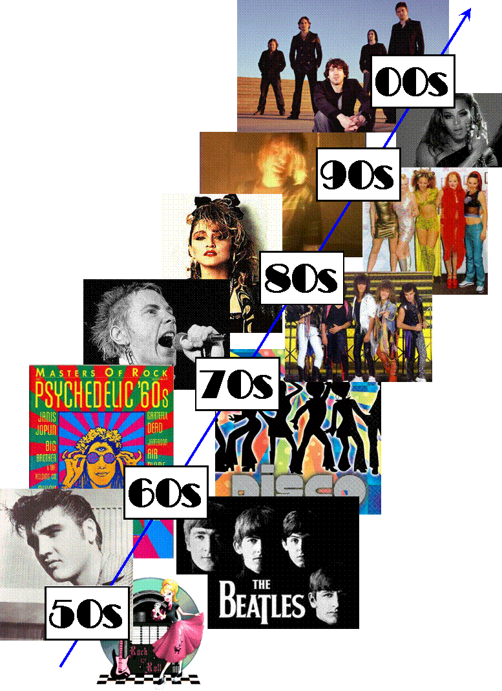
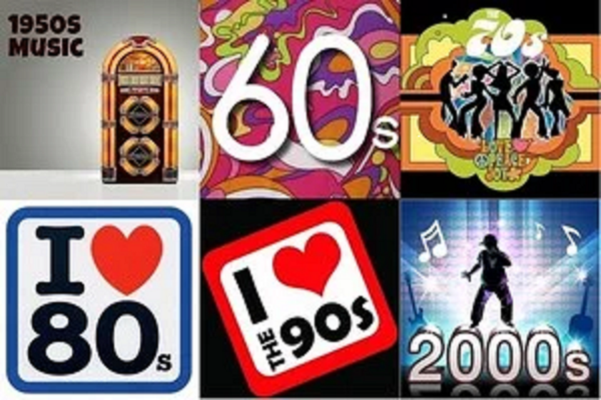

```{r setup, include=FALSE}
knitr::opts_chunk$set(echo = TRUE)
```



# Introduction

In the past 50 years, the world had gone through rapid revolutions in many aspects. Whether it's technology, movies, politics, or games, elements from one decade can be drastically different from those of another.

Does the same trend apply when it comes to music? In this report, we analyzed randomly selected songs and lyrics from the past half century and try to discover patterns that we may not have noticed before.

<font color = 'red'>*Note: the data used in this analysis only draws from artists of names starting with letters a - g, which omitted a significant amount of relevant information. The result and conclusions drawn here may or may not be close to the actual reality*</font>

```{r initialize, message=FALSE,warning=FALSE,echo=FALSE}
library(tidyverse)
library(tidytext)
library(plotly)
library(DT)
library(tm)
library(data.table)
library(scales)
library(wordcloud2)
library(gridExtra)
library(ngram)
library(shiny) 
library(RColorBrewer)
library(sentimentr)
library(syuzhet)
library(d3heatmap)
# load lyrics data
load('../output/processed_lyrics.RData') 

years <- seq(1970,2010,by = 10)
dt_lyrics <- dt_lyrics[dt_lyrics$year>=1970,]
dt_lyrics <- cbind(dt_lyrics,decade = years[findInterval(dt_lyrics$year,years)],songLen = str_count(dt_lyrics$lyrics,pattern = '\\w+'))

```

## Most Popular Bigrams

Let's first take a look at the most popular Bigrams broken down by decade:

```{r bigram, echo=FALSE,message=FALSE,warning=FALSE}
lyric_bigrams <- dt_lyrics %>%
  unnest_tokens(bigram, stemmedwords, token = "ngrams", n = 2)

bigram_counts <- lyric_bigrams %>%
  separate(bigram, c("word1", "word2"), sep = " ") %>%
  count(word1, word2,decade, sort = TRUE)

plotList <- list()
for (i in 1:length(years)){
  bigram_counts_sub <- bigram_counts[bigram_counts$decade==years[i],]
  combined_words <- apply(bigram_counts_sub[c(1, 2)], 1, paste , collapse = " " )[1:10]
  x_names <- factor(combined_words, levels = rev(combined_words))
  plotList[[i]] <- plot_ly(
    x = bigram_counts_sub$n[1:10],
    y = x_names,
    name =years[i],
    type = "bar",
    orientation = 'h'
  ) 
  
}
subplot(plotList,nrows = 2)
```
We can see that the most popular bigrams have not changed that much over the years. "Love love", "baby baby","time time", etc are persistent top bigrams.  Though some decades do have their standouts:

* 1970s: rock roll, break heart
* 1980s: ma ma, chain chain
* 1990s: life life
* 2000s: 
* 2010s: girl girl


## Proportion of Genres in Each Decade

Did the popularity of genres change over the years?

```{r Genre Proportion, echo=FALSE,message=FALSE,warning=FALSE}

genreCount <- dt_lyrics %>% count(genre,decade, sort = TRUE)
genreCountList <- split(genreCount,genreCount$decade)

plot_ly() %>%
  add_pie(data = genreCountList[[1]], labels = ~genre, values = ~n,
          name = names(genreCountList)[1], domain = list(row = 0, column = 0)) %>%
  add_pie(data = genreCountList[[2]], labels = ~genre, values = ~n,
          name = names(genreCountList)[2], domain = list(row = 0, column = 1)) %>%
  add_pie(data = genreCountList[[3]], labels = ~genre, values = ~n,
          name = names(genreCountList)[3], domain = list(row = 1, column = 0)) %>%
  add_pie(data = genreCountList[[4]], labels = ~genre, values = ~n,
          name = names(genreCountList)[4], domain = list(row = 1, column = 1)) %>%
  add_pie(data = genreCountList[[5]], labels = ~genre, values = ~n,
          name = names(genreCountList)[5], domain = list(row = 1, column = 2)) %>%
  layout(grid=list(rows=2, columns=3),
         xaxis = list(showgrid = FALSE, zeroline = FALSE, showticklabels = FALSE),
         yaxis = list(showgrid = FALSE, zeroline = FALSE, showticklabels = FALSE))

```
It's interesting to see that Rock music has declined in its share of music industry (from a whooping 64% in 1970s to 40% in 2010s!). This does explain the dropout of "rock roll" out of the most popular bigrams. Other patterns include:

* Increased popularity of Pop and Hip-hop music over the years
* Consistency of Jazz music
* Clear increase in Indie and Electronic music in the 2010s


## Length of Lyric Segments

It's been my personal impression that the modern music seem to focus on catchy short phrases compared to the classics in the past. Is that truly the case? Here I examined broke down each song to segments and computed the average length(number of characters) of segments by decade, excluding some outliers. It seems that there's no clear differences in distributions of lyric segment length.

```{r lyric segment length, echo=FALSE,message=FALSE,warning=FALSE}
lyric_segment <- dt_lyrics %>% unnest_tokens(sentence,lyrics,token = 'regex',pattern = '[:punct:]') %>% mutate(segLength = nchar(sentence))
lyrics_segment_len <- lyric_segment %>% select(id,decade,segLength) %>% group_by(id,decade) %>% summarize(aveLength = mean(segLength))
mycolors <- brewer.pal(5,'Accent')

lyrics_segment_len <- do.call(rbind, lapply(split(lyrics_segment_len, f = lyrics_segment_len$decade), FUN = function(x){
   qs <- quantile(x$aveLength,probs = c(0.005,0.995))
   x[x$aveLength >= qs[1] & x$aveLength <= qs[2],]
 }))

lyrics_segment_len$decade <- as.character(lyrics_segment_len$decade)
plot_ly(lyrics_segment_len,y = ~aveLength,color = ~decade,type = 'box',colors = mycolors) %>% layout(yaxis = list(title = 'Average Length of Lyric Segments'))


```


## What About The Length of The Songs?

It looks like the length of the songs (number of words), on average, have actually increased. Perhaps this has to do with the decreased share of rock music, which traditionally have less lyrics?

```{r song length, echo=FALSE,message=FALSE,warning=FALSE}
song_len <- dt_lyrics %>% select(id,decade,songLen)
mycolors <- brewer.pal(5,'Set1')

song_len <- do.call(rbind, lapply(split(song_len, f = song_len$decade), FUN = function(x){
  qs <- quantile(x$songLen,probs = c(0.005,0.995))
  x[x$songLen >= qs[1] & x$songLen <= qs[2],]
}))
song_len$decade <- as.character(song_len$decade)
plot_ly(song_len,y = ~songLen,color = ~decade,type = 'box') %>% layout(yaxis = list(title = 'Average Length(# of words) of Song'))


```

## Do We Feel Different?

Lastly, I examined the various level of emotions in song and compared them across decade and genre. 

```{r sentiments, echo=FALSE,message=FALSE,warning=FALSE}
##since this next segment takes a very long time to run, I've saved the data in ##the output folder for faster loading
dt_lyrics_sent <- get_nrc_sentiment(dt_lyrics$lyrics)
save(dt_lyrics_sent, file="../output/processed_song_sent.RData")
##########################################################################
# load("../output/processed_song_sent.RData")
dt_lyrics_sent <- (1/dt_lyrics$songLen * dt_lyrics_sent) %>% mutate(label = paste(dt_lyrics$genre,dt_lyrics$decade))
sentMat <-tbl_df(dt_lyrics_sent)%>%
  group_by(label)%>%
  summarise(
    anger=mean(anger,na.rm=TRUE),
    anticipation=mean(anticipation,na.rm=TRUE),
    disgust=mean(disgust,na.rm=TRUE),
    fear=mean(fear,na.rm=TRUE),
    joy=mean(joy,na.rm=TRUE),
    sadness=mean(sadness,na.rm=TRUE),
    surprise=mean(surprise,na.rm=TRUE),
    trust=mean(trust,na.rm=TRUE),
    negative=mean(negative,na.rm=TRUE),
    positive=mean(positive,na.rm=TRUE),
  ) %>% filter(!grepl('Not Available',label))
rnms <- sentMat$label;sentMat <- sentMat[,-1] %>% data.matrix();
rownames(sentMat) <- rnms


d3heatmap(sentMat, scale="none", colors= "Blues",
          xaxis_font_size = 8,Rowv = FALSE,Colv=FALSE,show_grid=TRUE)

```
The easiest pattern to spot here is that Metal music seem to have the strongest emotions, especially negative ones such as anger, fear, and sadness. It does appear though that the level of those negative emotions have decreased throughout the years. Hopefully that's an indication that people are becoming happier!

## Summary
Whether it's from personal experience, anecdote, or news, I've always held the opinion that the music we listen to have changed drastically over the years. This analysis shows that those changes are not too noticeable in the lyrics of the dataset we selected. The shift in music likely come more from their styles, tempo, melody, etc - elements that are not really included in this analysis. 





